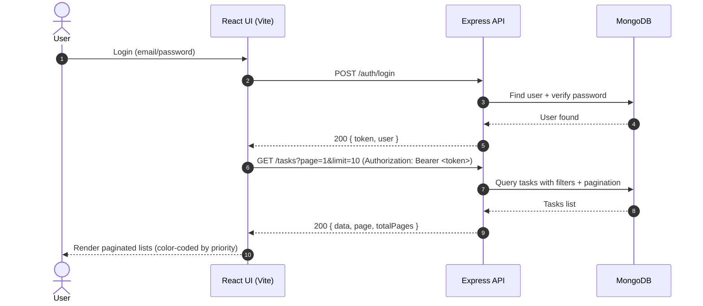
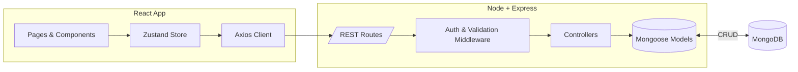

# MERN Task Manager

> A full‑stack Task Management System built with **MongoDB, Express, React, and Node.js**.  
> Features include authentication (JWT), role-based access control (admin/user), tasks CRUD, pagination with AJAX, status & priority updates, color‑coded lists, user management, and task assignment.

<p align="center">
  
  
  
  
</p>

---

## Table of Contents
- [Live Overview](#live-overview)
- [Architecture](#architecture)
- [Data Model](#data-model)
- [User Roles & Permissions](#user-roles--permissions)
- [Screens & UX](#screens--ux)
- [API Reference](#api-reference)
- [Getting Started](#getting-started)
- [Environment Variables](#environment-variables)
- [Run & Dev Scripts](#run--dev-scripts)
- [Quick API Tests (cURL)](#quick-api-tests-curl)
- [Folder Structure](#folder-structure)
- [Security Notes](#security-notes)
- [Troubleshooting](#troubleshooting)
- [Roadmap / Nice‑to‑haves](#roadmap--nice-to-haves)
- [License](#license)

---

## Live Overview

### Feature Summary
- **Task Creation** with title, description, due date, priority
- **Task List** with **pagination + search + filters**
- **Task Details** page
- **Task Edit/Delete** (with confirmation dialog)
- **Status Update** (pending/in‑progress/completed/blocked)
- **Authentication** (JWT) & **Authorization** (RBAC: admin/user)
- **User Management** (admin: add/remove users, assign tasks)
- **Priority Management** (move between low/medium/high/urgent)
- **Visual cues**: color‑coded priority badges

### Request Lifecycle (High‑level)


---

## Architecture


---


## User Roles & Permissions
| Action | User | Admin |
|-------|------|-------|
| Register / Login | ✅ | ✅ |
| Create task | ✅ (self) | ✅ |
| View tasks | ✅ (own/assigned) | ✅ (all) |
| Edit task | ✅ (own) | ✅ (any) |
| Delete task | ✅ (own) | ✅ (any) |
| Update status/priority | ✅ (own) | ✅ |
| Manage users (list/add/remove/update) | ❌ | ✅ |
| Assign task to a user | ❌ | ✅ |

---

## Screens & UX
- **Login** → JWT issued on success and stored in memory/localStorage.
- **Dashboard** → Create/Edit form, filters (search, status, priority), **four priority lists** (urgent/high/medium/low), pagination controls.
- **Task Details** → Read-only description + due date; link back to dashboard.
- **Users (Admin)** → Add/remove users and set roles.

Priority colors: **low**(green), **medium**(yellow), **high**(orange), **urgent**(red).

---

## API Reference

Base URL: `http://localhost:5000/api/v1`

### Auth
- `POST /auth/register` → Create user (admin preferred)
- `POST /auth/login` → `{ email, password }` → `{ token, user }`

### Users (admin)
- `GET /users` → list users (paginate internally)
- `POST /users` → `{ name, email, password, role }`
- `PATCH /users/:id` → update user
- `DELETE /users/:id`

### Tasks
- `POST /tasks` → Create task `{ title, description?, dueDate?, priority?, assignee? }`
- `GET /tasks` → List `?page&limit&search&status&priority&assignee&mine=true`
- `GET /tasks/:id` → Task details
- `PATCH /tasks/:id` → Edit fields
- `DELETE /tasks/:id`
- `PATCH /tasks/:id/status` → `{ status }`
- `PATCH /tasks/:id/priority` → `{ priority }`
- `PATCH /tasks/:id/assign/:userId` → Admin assigns

Pagination response:
```json
{
  "data": [],
  "page": 1,
  "limit": 10,
  "totalPages": 5,
  "totalItems": 44
}
```

---

## Getting Started

### 1) Prerequisites
- Node.js 20+
- MongoDB running locally (or a connection string)
- Git

### 2) Clone & Install
```bash
git clone <YOUR_REPO_URL> mern-task-manager
cd mern-task-manager

# Backend
cd server
npm i
cp .env.example .env    # edit as needed
npm run seed            # creates admin@example.com / admin123
npm run dev             # http://localhost:5000

# Frontend (new terminal)
cd ../client
npm i
npm run dev             # http://localhost:5173
```

### 3) Login
Open `http://localhost:5173` → **admin@example.com / admin123**

---

## Environment Variables

Create `server/.env` (not committed; see `.env.example`):
```env
PORT=5000
MONGO_URI=mongodb://localhost:27017/mern_task_manager
JWT_SECRET=supersecretlongrandom
JWT_EXPIRES_IN=7d
CLIENT_URL=http://localhost:5173
```

---

## Run & Dev Scripts

### Server
| Script | Description |
|-------|-------------|
| `npm run dev` | Start API with nodemon |
| `npm run seed` | Seed admin user |

### Client
| Script | Description |
|-------|-------------|
| `npm run dev` | Start Vite dev server |
| `npm run build` | Production build |
| `npm run preview` | Preview prod build |

---

## Quick API Tests (cURL)

```bash
# Login
curl -s http://localhost:5000/api/v1/auth/login \
  -H 'Content-Type: application/json' \
  -d '{"email":"admin@example.com","password":"admin123"}'

# Create a task (replace YOUR_TOKEN)
curl -s http://localhost:5000/api/v1/tasks \
  -H "Authorization: Bearer YOUR_TOKEN" \
  -H 'Content-Type: application/json' \
  -d '{"title":"Write README","priority":"high"}'

# List tasks
curl -s "http://localhost:5000/api/v1/tasks?page=1&limit=10" \
  -H "Authorization: Bearer YOUR_TOKEN"
```

---

## Folder Structure
```
root
├─ server/
│  ├─ src/
│  │  ├─ config/      # db connection
│  │  ├─ controllers/ # route handlers
│  │  ├─ middleware/  # auth, validation, errors
│  │  ├─ models/      # User, Task
│  │  ├─ routes/      # /auth /users /tasks
│  │  ├─ utils/       # helpers (paginate, seed)
│  │  ├─ app.js
│  │  └─ server.js
│  └─ .env(.example)
└─ client/
   └─ src/
      ├─ api/         # axios instance
      ├─ components/  # UI components
      ├─ pages/       # Login, Dashboard, Users, TaskDetails
      ├─ store/       # zustand stores
      ├─ App.jsx, main.jsx
      └─ index.css
```

---

## Security Notes
- Passwords are **hashed with bcrypt**.
- **JWT** used for stateless auth; protect routes with `Authorization: Bearer <token>`.
- Input validation via **express‑validator**.
- CORS restricted to `CLIENT_URL`.
- Pagination `limit` is capped to prevent abuse.

---

## Troubleshooting

### Blank page at `http://localhost:5173`
- Ensure `client/vite.config.js` exists and `npm run dev` shows a running server.
- Clear the console and check for red errors; reinstall deps:
  ```bash
  rm -rf node_modules package-lock.json
  npm i
  npm run dev
  ```

### API shows only “API OK”
- That’s expected for `/` root. Use client at `http://localhost:5173` or call API endpoints under `/api/v1/...`.

### 401 Unauthorized
- You must include the JWT token in `Authorization` header when calling protected routes.

### Mongo connection failed
- Confirm `MONGO_URI` in `.env` and that MongoDB is running.

---

## Roadmap / Nice‑to‑haves
- Refresh tokens + httpOnly cookies
- Drag‑and‑drop between priority lists
- Email reminders for due tasks
- Docker & docker‑compose
- Rate limiting & helmet
- E2E tests (Playwright) and API tests (Jest/Supertest)

---

## License
MIT © Subham Agarwal(7029054307)
VIT University
